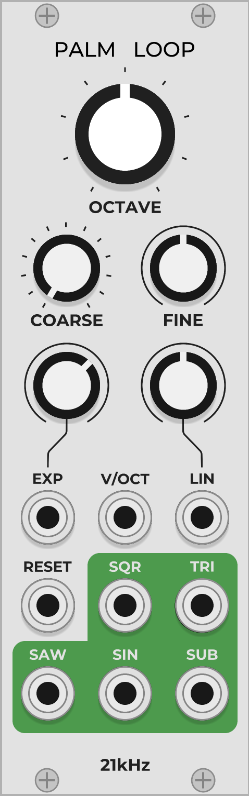

# 21kHz 0.6.0

A couple of modules I made for [VCVRack](https://vcvrack.com/). More to come. The following is a list of and documentation for each module in the plugin.

## Palm Loop

Palm Loop is a basic and CPU-friendly VCO, implementing through-zero FM and polyBLEP and polyBLAMP antialiasing.

The OCTAVE, COARSE, and FINE knobs change the oscillator frequency, which is C4 by default. The OCTAVE knob changes the frequency in octave increments (C0 to C8), the COARSE knob in half-step increments (+0 to +12), and the FINE knob within a continuous +/-1 half-step range.

The V/OCT input is the master pitch input. The EXP input is for exponential frequency modulation and has a dedicated attenuverter. Similarly, the LIN input is for through-zero linear frequency modulation and also has a dedicated attenuverter. The RESET input restarts each waveform output at the beginning of its cycle upon recieving a trigger. The reset is not antialiased.

There are five outputs. The SQR and TRI outputs are pitched an octave below, as is the SUB output which is a sine wave.

Tips: Since there's not much in the way of waveshaping, Palm Loop works shines when doing FM, perhaps paired with a second one. The LIN input is for the classic glassy FM harmonics. Use the EXP input for harsh inharmonic timbres. If you have one modulating another, RESET both on the same trigger to keep the timbre consistent across pitch changes. Mix or scan the outputs for varied waveshapes.
