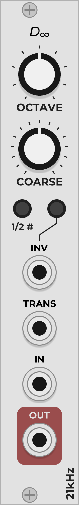
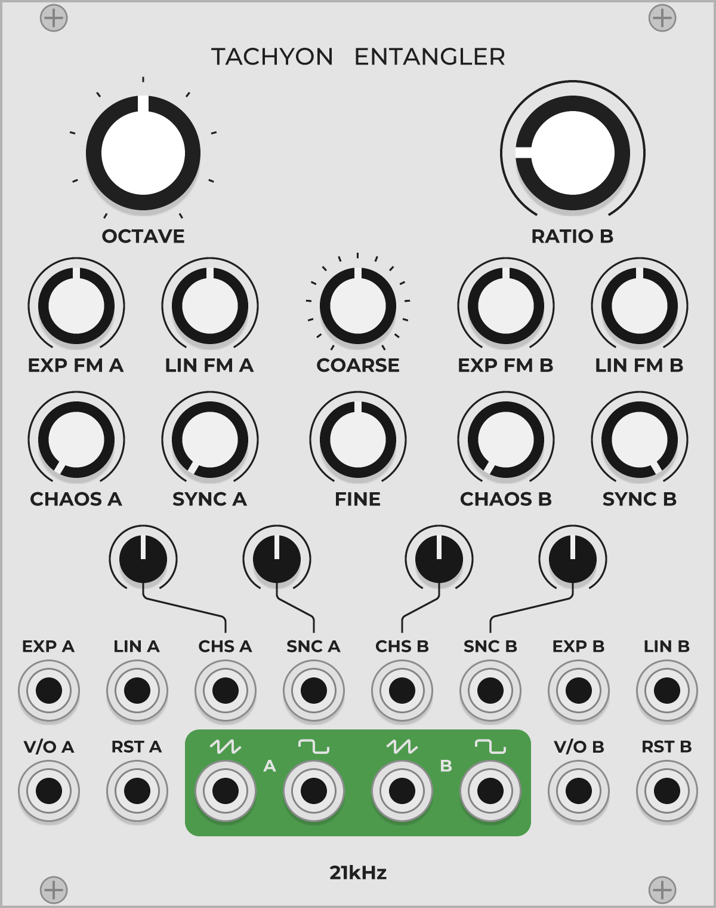

# 21kHz 0.6.1

A couple of modules I made for [VCV Rack](https://vcvrack.com/). More to come. The following is a list of and documentation for each module in the plugin. Also, I've linked to audio demos next to the section title of some modules.

## Palm Loop ([Audio Demo](https://clyp.it/d5zatc4a))

Palm Loop is a basic and CPU-friendly VCO, implementing through-zero FM and polyBLEP and polyBLAMP antialiasing.

The OCTAVE, COARSE, and FINE knobs change the oscillator frequency, which is C4 by default. The OCTAVE knob changes the frequency in octave increments (C0 to C8), the COARSE knob in half-step increments (-7 to +7), and the FINE knob within a continuous +/-1 half-step range.

The V/OCT input is the master pitch input. The EXP input is for exponential frequency modulation, and the LIN input is for through-zero linear frequency modulation, both having a dedicated attenuverter. The RESET input restarts each waveform output at the beginning of its cycle upon recieving a trigger. The reset is not antialiased.

There are five outputs. The top two are saw and sine, and the bottom three are square, triangle, and sine. The bottom three waveforms are pitched an octave lower.

**Tips**
- Since there's not much in the way of waveshaping, Palm Loop shines when doing FM, perhaps paired with a second. 
- The LIN input is for the classic glassy FM harmonics; use the EXP input for harsh inharmonic timbres.
- If you have one modulating another, RESET both on the same trigger to keep the timbre consistent across pitch changes.
- Mix or scan the outputs for varied waveshapes.

## *D*∞

A basic module for modifying V/OCT signals by transposition and inversion.

The OCTAVE knob transposes the signal in octave increments (-4 to +4), and the COARSE knob transposes it in half step increments (-7 to +7). The 1/2 # button raises the transposed signal by a quarter step, so quartertone transpositions can be achieved. When the INV button is on, the incoming signal is inverted about 0V before being transposed.

The rest of the controls determine when the transposition and inversion are done. Both the TRANS and INV input accept triggers. By default, if there is no input at the TRANS port, the transposition is always active. If the TRANS port has an input, then a trigger from that input will toggle the transposition between being active and inactive. The INV input acts the same, but only if the corresponding button is on; if it is off, the signal is never inverted.

**Tips**
- Swap between differently transposed sequences with a sequential switch for controlled harmonic movement.
- Send the same trigger to both INV and TRANS, and transpose so that the inverted signal is in the same key as the unaltered signal. The trigger will create some nice melodic variation, especially if it is offset from the main rhythm.

## Tachyon Entangler

The Tachyon Entangler is an antialiased chaotic sync oscillator, and is at its core two Palm Loop oscillators with chaos, which can be probabilistically cross-synced. By default, oscillator A (left) is the master and oscillator B (right) is the slave.

The OCTAVE, COARSE and FINE knobs are master pitch controls for both oscillators and function identically to Palm Loop. The RATIO B knob changes the frequency ratio of oscillator B with respect to the master pitch. Sweeping this gives the classic sync sound.

Each oscillator has exponential and linear FM inputs and attenuverters. In addition, they both have CHAOS and SYNC knobs. The CHAOS knob basically introduces randomness into the oscillation, making the signal noisy. The SYNC knob is the probability that the oscillator will be synced to the other. Fully counterclockwise is no sync and fully clockwise is hard sync; settings in between yield glitchy and stuttery effects (12 o'clock being the most chaotic sounding setting). The CHAOS and SYNC settings also have modulation inputs and dedicated attenuverters.

Each oscillator also has a V/O (volt per octave, i.e. pitch) input and a RST (reset) input. Note that the V/O A is by default normalled to V/O B. Finally, each oscillator has two outputs, saw and square. As in Palm Loop, the square output is pitched an octave lower, and the sync algorithm for the square waveform functions somewhat unconventionally, giving a unique sound (make sure to mess with the RATIO knob!).

**Tips**
- FM of the synced oscillator can produce some crazy harmonic effects, as can cross-modulation of the two oscillators.
- Subtle offsetting of the CHAOS and SYNC knobs from the "clean" positions can create some interesting effects. Each of these knobs can give a different character to the sound.
- If you self-modulate enough, you can turn it into a weird quad noise generator, each output being slightly different. Sometimes the noise will cut in and out of existence.
